# Qwen2-0.5B Experimental Plan Visualization

## Overview: Complete Experimental Pipeline (72 Experiments)

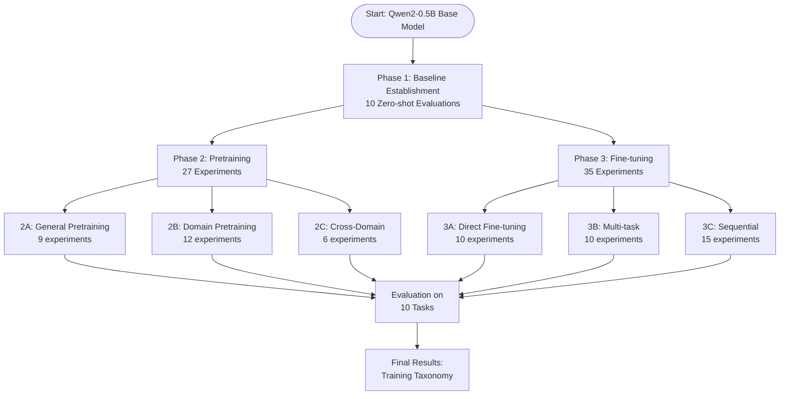

## Phase 1: Baseline Establishment (10 experiments)

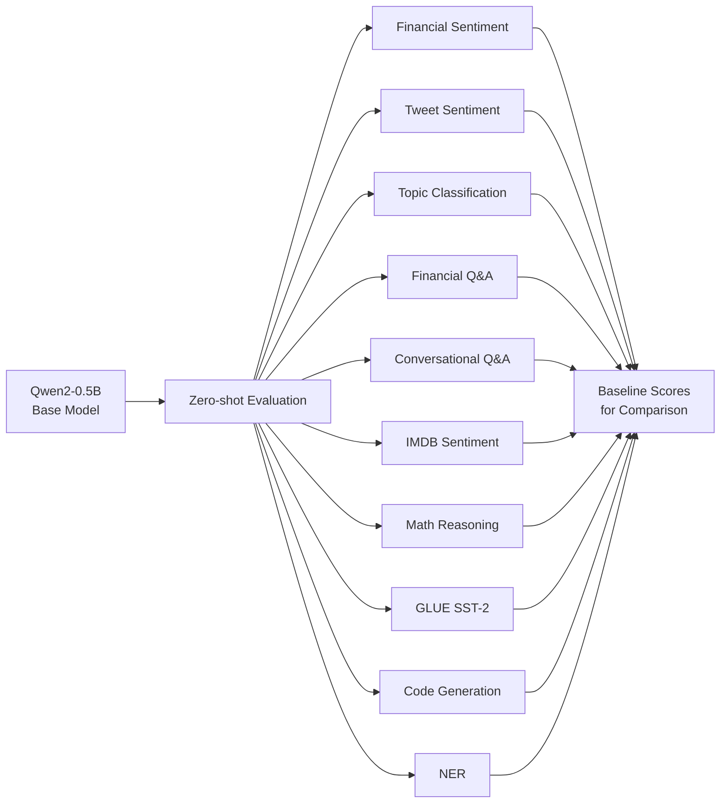

## Phase 2: Pretraining Experiments (27 experiments)

### 2A: General Pretraining (9 experiments)

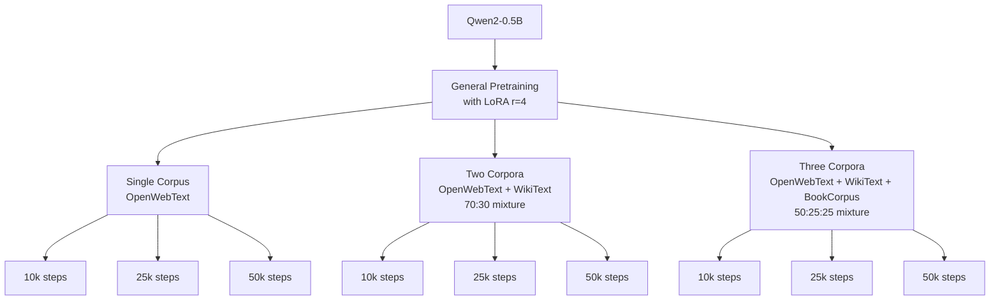

### 2B: Domain Continued Pretraining (12 experiments)

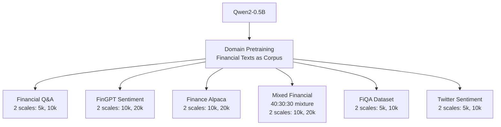

### 2C: Cross-Domain Pretraining (6 experiments)

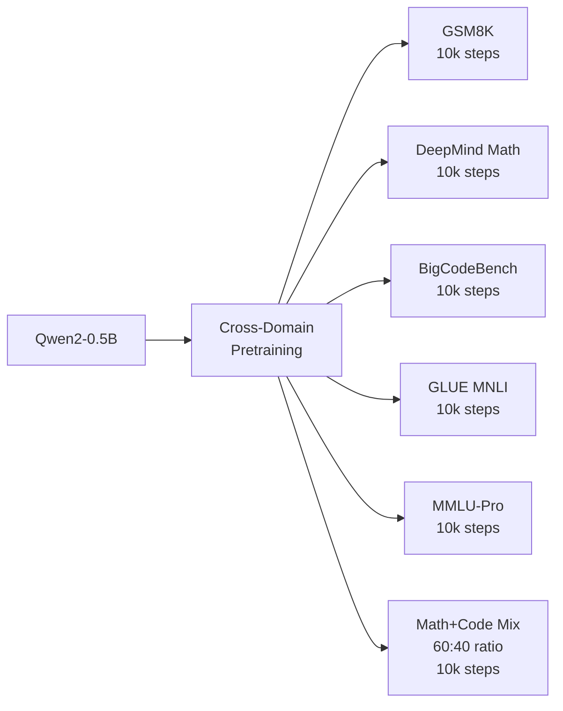

## Phase 3: Fine-tuning Experiments (35 experiments)

### 3A: Direct Fine-tuning (10 experiments)

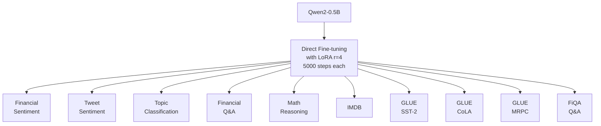

### 3B: Multi-task Fine-tuning (10 experiments)

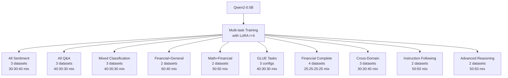

### 3C: Sequential Fine-tuning (15 experiments, 6 sequences)

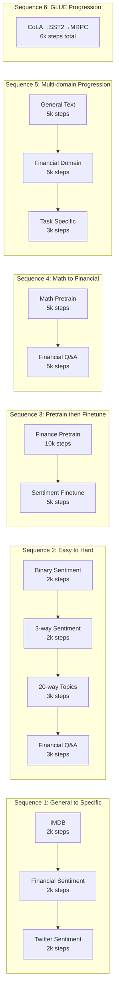

## Evaluation Framework

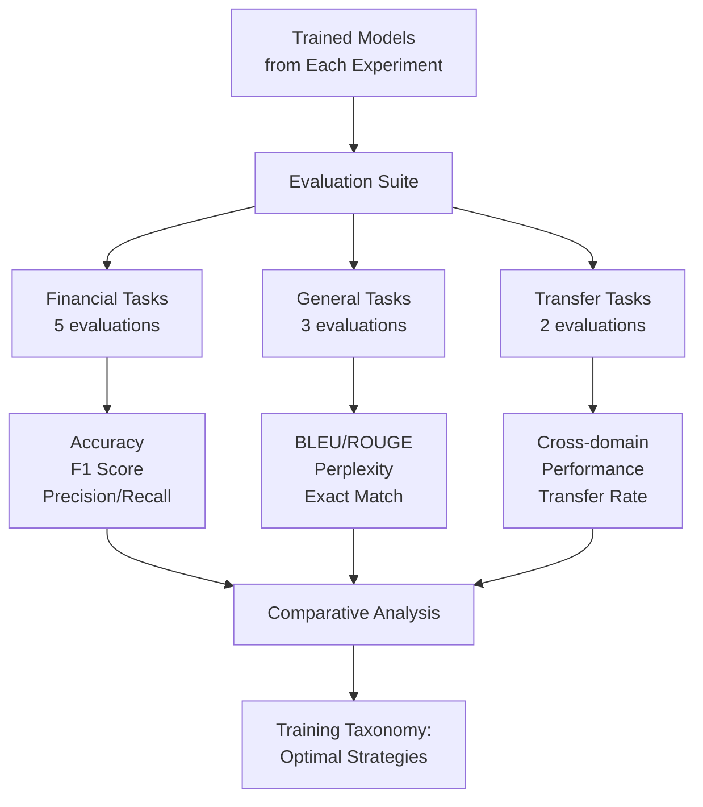

## Resource Flow and Timeline

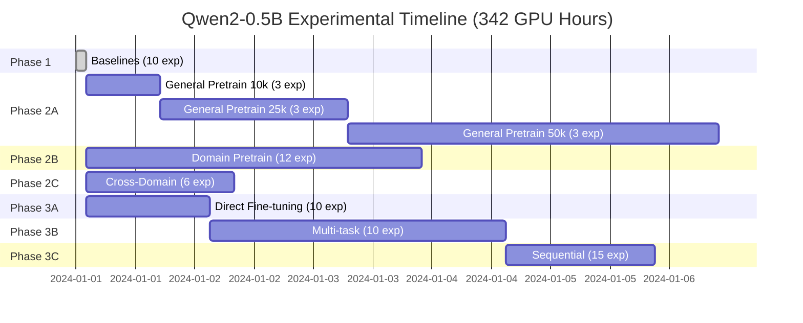

## Key Insights from Experimental Design

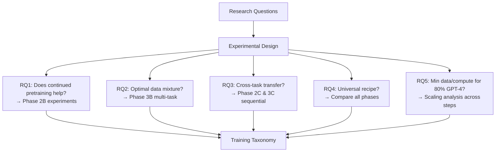

## Cost-Optimized Path (82 GPU Hours)

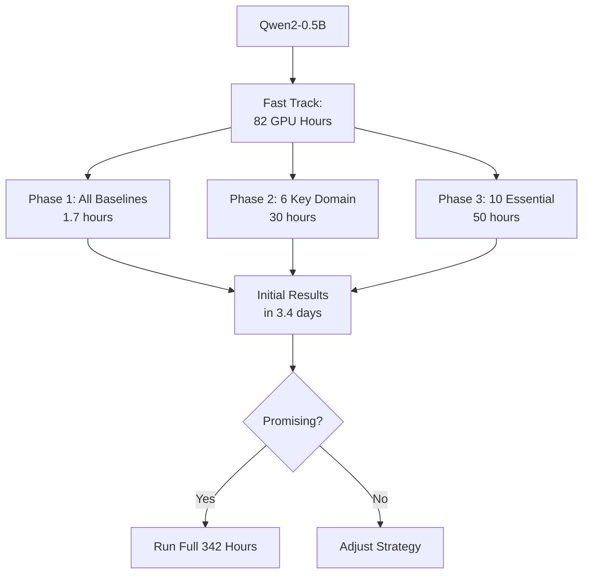

## Summary Statistics

| Phase | Experiments | GPU Hours | Key Question Answered |
|-------|------------|-----------|----------------------|
| 1 | 10 | 1.7 | What's the zero-shot baseline? |
| 2A | 9 | 127.5 | Does general pretraining help? |
| 2B | 12 | 67.5 | Does domain pretraining help? |
| 2C | 6 | 30.0 | Does cross-domain help? |
| 3A | 10 | 25.0 | How well does direct fine-tuning work? |
| 3B | 10 | 60.0 | Are multi-task approaches better? |
| 3C | 15 | 30.0 | Do sequential strategies help? |
| **Total** | **72** | **341.7** | **Complete Training Taxonomy** |